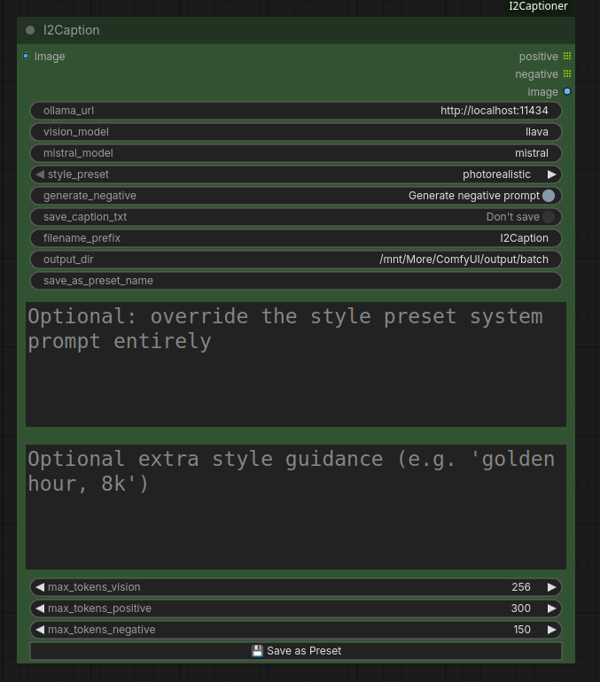
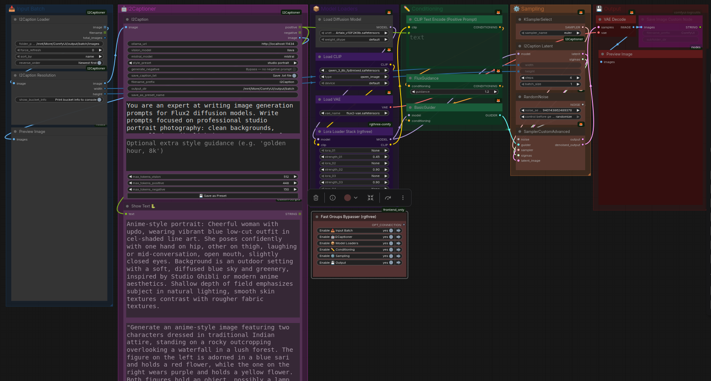

# I2Captioner — ComfyUI Node Pack

A Flux2-focused image captioning and prompt generation pipeline for ComfyUI, powered by [Ollama](https://ollama.com). Drop in an image, get a ready-to-use Flux2 prompt out.

---

# What it does

Most captioning nodes either describe an image or generate a prompt — I2Captioner does both in a single chained pipeline:

1. **Stage 1 — Vision:** A vision model (LLaVA or similar) describes the image in natural language
2. **Stage 2 — Prompt rewrite:** A language model (Mistral or similar) rewrites that description as a Flux2-optimised positive prompt, guided by your chosen style preset
3. **Stage 3 — Negative prompt** *(optional):* The same language model generates a matching negative prompt

After captioning, both models are immediately unloaded from VRAM so Flux2 can load without memory pressure.



---

# Nodes

# `I2Caption`
The core captioning node. Takes an image, runs the two-stage Ollama pipeline, and outputs positive prompt, negative prompt, and the original image passthrough.

| Input | Description |
|---|---|
| `image` | Source image (wire from I2Caption Loader or any image node) |
| `ollama_url` | Ollama API endpoint (default: `http://localhost:11434`) |
| `vision_model` | Vision model name (default: `llava`) |
| `mistral_model` | Language model name (default: `mistral`) |
| `style_preset` | Style preset dropdown — loaded from `system_prompts.json` |
| `generate_negative` | Toggle negative prompt generation on/off |
| `save_caption_txt` | Save matched `.png` + `.txt` pairs to disk |
| `filename_prefix` | Prefix for saved files (e.g. `I2Caption` → `I2Caption_00001_.png`) |
| `output_dir` | Folder to save files to |
| `custom_system_prompt` | Override the preset system prompt directly |
| `style_hint` | Extra style guidance appended to the prompt request |

**Outputs:** `positive` (STRING), `negative` (STRING), `image` (IMAGE)

---

# `I2Caption Loader`
A batch image loader that re-scans its folder on every queue run — no restart needed when you add or remove images. Wire a RandomNoise seed into `force_refresh` for automatic re-scan every run.

| Input | Description |
|---|---|
| `folder_path` | Absolute path to a folder of images |
| `force_refresh` | Change this value to trigger a re-scan (wire from RandomNoise) |
| `sort_by` | Sort order: `name`, `date_modified`, or `date_created` |
| `reverse_order` | Flip sort direction |

**Outputs:** `image` (IMAGE list), `filename` (STRING list), `total_images` (INT)

---

# `I2Caption Resolution`
Snaps an image to the nearest Flux2 training resolution bucket, preserving aspect ratio. Prevents composition and quality degradation from off-bucket dimensions.

**Outputs:** `image` (IMAGE), `width` (INT), `height` (INT) — wire width/height directly to `I2Caption Latent`.

---

# `I2Caption Latent`
Combines `Flux2Scheduler` and `EmptyFlux2LatentImage` into one node. Takes width, height, and steps, outputs SIGMAS and LATENT ready for `SamplerCustomAdvanced`.

---

# Style Presets

Presets are stored in `system_prompts.json` and loaded at startup. The following presets are included:

| Preset | Description |
|---|---|
| `photorealistic` | Sharp focus, realistic lighting, camera and lens details |
| `cinematic` | Dramatic lighting, film grain, movie colour grading |
| `anime` | Clean line art, cel shading, vibrant colours |
| `oil painting` | Classical Old Masters style with visible brushwork |
| `concept art` | Game and film production painterly style |
| `fantasy illustration` | Magical atmosphere, ethereal lighting |
| `dark moody` | Low-key lighting, noir and gothic atmosphere |
| `studio portrait` | Professional studio photography |
| `my mix` | Pop art, surrealism, and dadaism blended |

# Adding your own presets
Select any preset from the dropdown, edit the `custom_system_prompt` and `style_hint` textareas, enter a name in `save_as_preset_name`, and click **💾 Save as Preset**. The preset is saved to `system_prompts.json` and appears in the dropdown immediately — no restart required.

Selecting a preset from the dropdown automatically loads its `system_prompt` and `style_hint` into the editable textareas so you can inspect or tweak before running.

---

# Saved output files

When `save_caption_txt` is enabled, I2Captioner saves matched pairs directly — no separate Save Image node needed:

```
output_dir/
├── I2Caption_00001_.png
├── I2Caption_00001_.txt
├── I2Caption_00002_.png
├── I2Caption_00002_.txt
```

The counter is based on existing `.png` files in the folder and always continues from where it left off.

---

# Requirements

- [Ollama](https://ollama.com) running locally
- At least one vision model and one language model pulled:
- 
ollama pull llava
ollama pull mistral
```

Any Ollama-compatible vision model (e.g. `llava`, `bakllava`, `moondream`) and language model (e.g. `mistral`, `llama3`, `phi3`) will work — just enter the model name in the node.

---

# Installation

### Via ComfyUI Manager *(recommended)*
Search for **I2Captioner** in the ComfyUI Manager custom node list and click Install. (coming soon)

# Manual Install

# Clone the repository
git clone https://github.com/MrMorehole/I2Captioner
# Install dependencies
pip install -r I2Captioner/requirements.txt


Restart ComfyUI after installation.

---

# Included workflow

`Workflow_I2Caption.json` — a complete Flux2 workflow demonstrating the full pipeline:
- Batch image loading with auto-refresh
- Resolution snapping to Flux2 buckets
- Two-stage captioning with style presets
- Fast Groups Bypasser for enabling/disabling the captioning sections



## License

Creative Commons.
